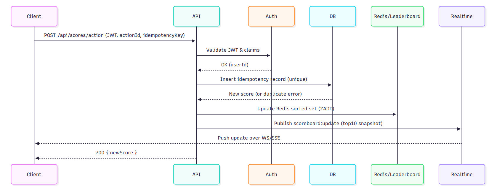

# Live Scoreboard API Service — Specification

## Overview

This module is the backend API responsible for securely updating user scores and broadcasting live top-10 leaderboard updates to connected clients (web or mobile).

Primary goals:
- Accept authorized action completion events from clients
- Update user scores atomically and idempotently
- Produce low-latency real-time updates for the top-10 leaderboard
- Prevent unauthorized or forged score updates

## Actors
- Client (Web/Mobile)
- API Server (this module)
- Auth Provider (JWT/OAuth)
- Database (primary score store)
- Realtime Transport (WebSocket or SSE / PubSub)

## High-Level Flow (summary)
1. Client finishes an action and sends `POST /api/scores/action` with JWT and action payload.
2. API validates JWT, verifies action legitimacy (optionally with action service), and checks idempotency.
3. API atomically updates the user's score in the DB and records the action for auditing/idempotency.
4. API publishes a `scoreboard:update` event (includes new top-10 snapshot) to realtime transport.
5. Connected clients receive the update and refresh the UI.

## API Design

### POST /api/scores/action
- Purpose: register a completed action and increase user's score
- Auth: `Authorization: Bearer <JWT>` (required)
- Request body (JSON):
    - `actionId` (string): opaque ID of the action instance
    - `scoreDelta` (integer): score to add (server should validate allowed deltas)
    - `idempotencyKey` (string, optional): client-supplied key to prevent double-processing

Example request:

```json
POST /api/scores/action
Authorization: Bearer <JWT>

{
    "actionId": "abc-123",
    "scoreDelta": 10,
    "idempotencyKey": "client-generated-uuid"
}
```

Example response (200):

```json
{
    "success": true,
    "userId": "u1",
    "newScore": 120
}
```

### Server responsibilities
- Validate JWT and extract `userId`.
- Validate that `scoreDelta` is allowed for the given `actionId`.
- Check idempotency: if `idempotencyKey` or `actionId` already processed for `userId`, return previous result (409 or 200 with same payload).
- Atomically increment user score in DB and persist an action record (transaction or compare-and-set depending on DB support).
- Recompute or update top-10 ranking efficiently and publish a realtime event with the updated top-10 snapshot.
- Return the updated user score to caller.

## Real-time strategy
- Transport options: WebSocket (preferred for bidirectional) or SSE (simpler, server-to-client only).
- Use a pub/sub system (Redis Pub/Sub, Kafka, or cloud pubsub) to distribute leaderboard update events across API server instances.
- Event name: `scoreboard:update` with payload:

```json
{
    "top10": [ { "userId": "u1", "score": 250 }, ... ],
    "updatedAt": "2025-12-31T23:59:59Z"
}
```

Clients subscribe via the realtime connection and apply the incoming snapshot.

## Data model (suggested)
- users collection/table
    - userId (PK)
    - score (integer)

- actions collection/table (audit & idempotency)
    - actionId (PK) — optional, if provided by client or action service
    - userId
    - scoreDelta
    - idempotencyKey
    - processedAt

- leaderboard cache (in cache memory)
    - Sorted set keyed by score for fast top-N queries

## Consistency & concurrency
- Use DB features for atomic increments (e.g., MongoDB `$inc`, Postgres `UPDATE ... RETURNING`) and persist an action record in same transaction when possible.
- When transactions aren't available, use a two-phase approach: insert idempotency record with unique constraint, then `UPDATE` score only if insert succeeded.
- Use Redis Sorted Sets to maintain top-N efficiently; update the sorted set after DB increment.

## Idempotency
- Require or strongly encourage an `idempotencyKey` or use the `actionId` as a unique key to prevent duplicate processing.
- Make the actions table have a unique index on `(actionId)` or `(userId, idempotencyKey)`.

## Security & Validation
- Authenticate requests with JWT; verify signature, `exp`, `iss`, and `scope`/claims.
- Authorize that the token's `userId` matches the owner of the action.
- Validate `scoreDelta` against allowed ranges and action types.
- Rate-limit endpoints per user/IP to prevent abuse.
- Require TLS for all client-server and server-server communications.

## Error handling and status codes
- 200: success (returns `newScore`).
- 400: malformed request (missing fields).
- 401: invalid/expired JWT.
- 403: unauthorized action.
- 409: duplicate action/idempotency conflict (client should retry safely).
- 429: rate limit exceeded.
- 500: internal error.

## Testing guidance
- Unit tests for validation, idempotency handling, and ranking logic.
- Integration tests against a real DB and Redis (or testcontainers).
- Load tests to measure latency and scale characteristics for top-N updates.

## Sequence Diagram



## Improvements & additional suggestions
- Leaderboard partitioning: maintain daily/weekly/all-time leaderboards separately for efficient queries.
- Backpressure: ensure pub/sub and websocket layers can handle spikes (rate limit + sampling fallback).
- Privacy: avoid leaking in realtime payloads; send only `userId` and score or display names only if allowed.

## Example operational checklist for implementers
1. Add `actions` table/collection with unique constraint on `actionId`/`idempotencyKey`.
2. Implement `POST /api/scores/action` with JWT validation and idempotency check.
3. Use atomic DB increment for score, then update Redis sorted set.
4. Publish `scoreboard:update` via pub/sub; workers push to connected websockets.
5. Add monitoring dashboards for latency, error rates, and top-10 correctness.